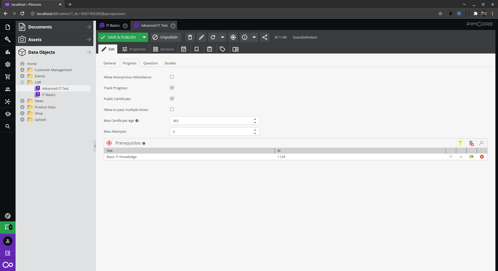
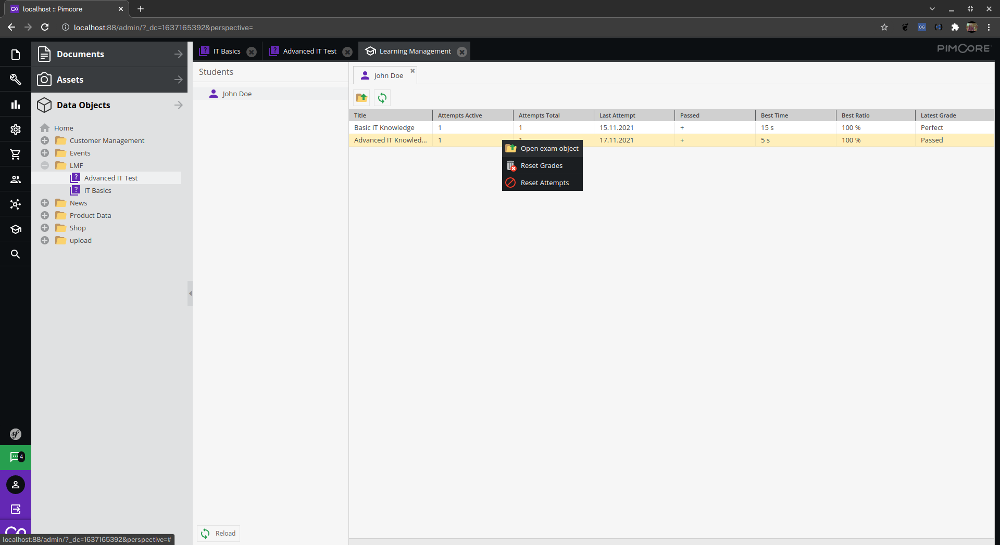
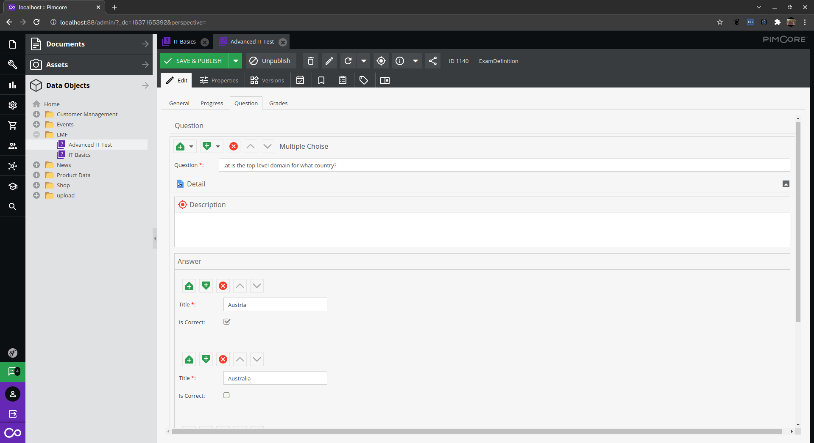

   

# Pimcore Learning Management Framework

This framework is inspired by [Pimcore Academy](https://pimcore.com/de/developer/academy), [Programming Hub](https://programminghub.io/) and many other resources that provide knowledge to the comunity.

As it is implied by the name this repository does not provide a ready to use solution. It contains baisic tools and classes to implement your own in a short amount of time. You can integrate it with the [Pimcore Customer Data Framework](https://github.com/pimcore/customer-data-framework), [Pimmcore Members](https://github.com/dachcom-digital/pimcore-members) or your own Implementation of the Student Class.

1. [Installation](doc/01_Installation.md)
2. [Configuration](doc/02_Configuration.md)
3. [Usage example](doc/03_Usage_Example.md)
4. [Customization](doc/04_Customization.md)

Includes parts of [Material design icons](https://github.com/google/material-design-icons/blob/master/LICENSE)

